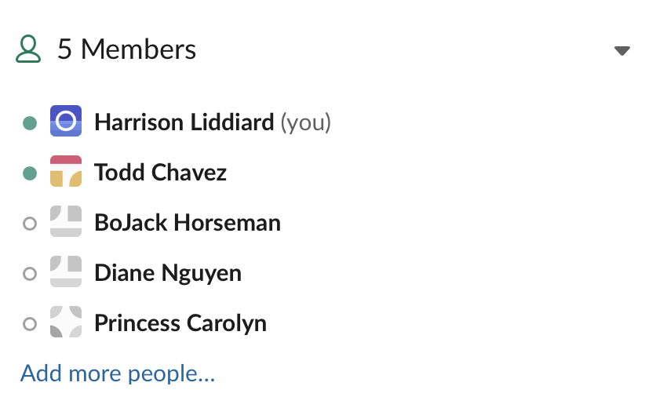
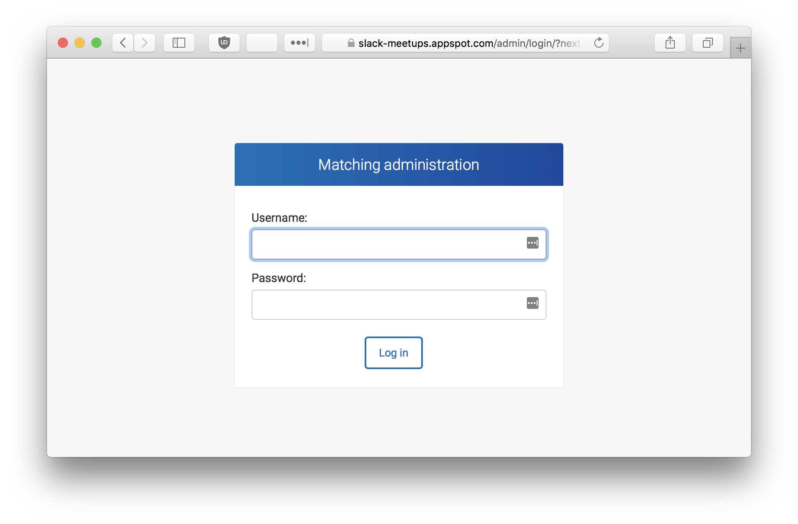
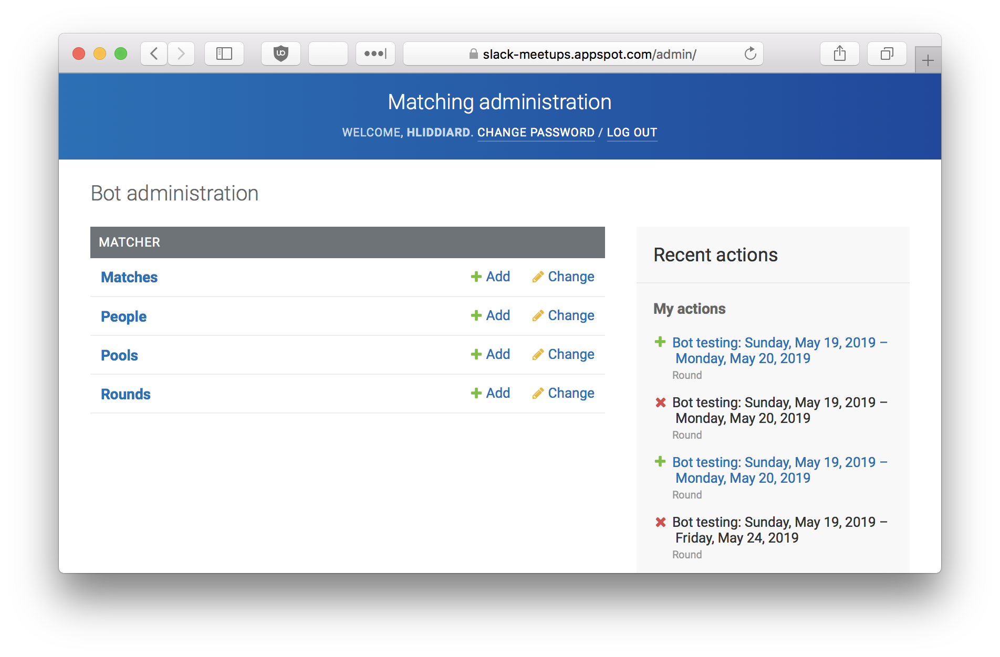
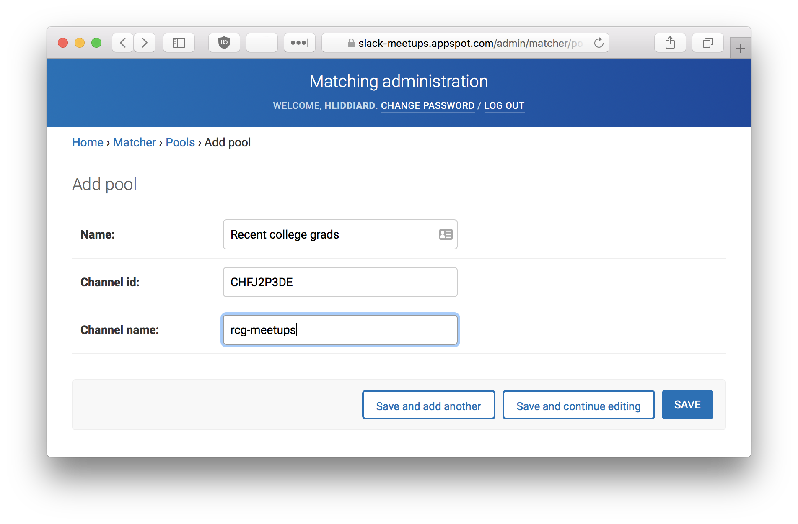
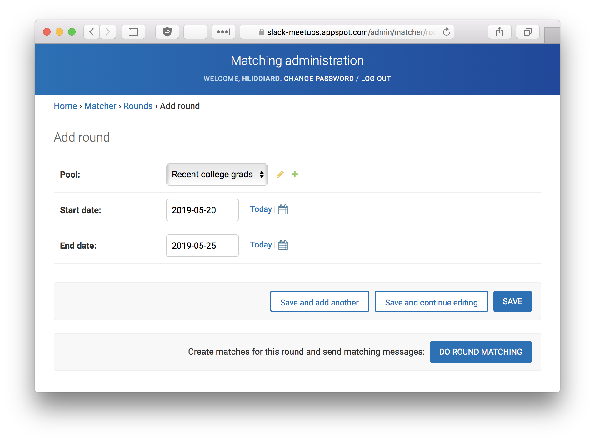
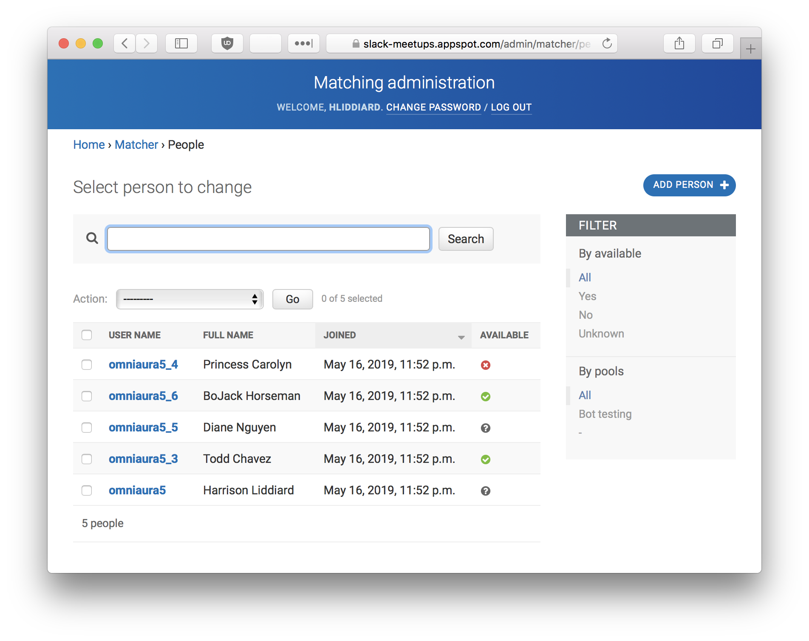

#  Slack Meetups

A Slack bot that randomly pairs users in a Slack channel for 1:1 meetups. Meet new, interesting people in your company, club, or group!

## Features

- 💬 Requests a custom introduction for each person
- ❓ Asks availability each round for everyone in the matching pool
- 🎲 Randomly pairs people to meet via direct message
- 🤝 Collects feedback on who actually met up

It supports variable frequency and length for rounds of matching, multiple matching "pools", and has an admin interface to manage membership, pools, and matching rounds.

## Tech stack

- Django running on Python 3.7+
- Postgres on Google Cloud SQL (via proxy for local development)
- Slack Python SDK

## User guide for admins

*Note: This section assumes an already-configured and deployed server. For deployment instructions, [see below](#deployment-instructions).*

### Add people to a Slack channel

First, get a Slack channel to work with. The bot will automatically message all channel members when you start a new round, so the people in this channel should be at the least aware, and ideally willing to participate. You can use an existing Slack channel or create a new one, but for this reason you may want to have a dedicated channel for the meetup bot.

There is no limit to the number of members who can be in the channel. The more the merrier!



Once you have a channel with some members, you're ready to create a matching pool.

### Create a pool

Log in to the admin interface at `https://<whatever your base url is>/admin/`. The login should look like this:



After logging in, you should see the admin dashboard:



Under the "Matcher" list to the right of "Pools", click the "Add" button. Fill out the info on the page:



- "Name": a human-readable descriptor for the pool, like “2020 interns”
- "Channel ID": Slack's unique identifier for the channel. You can find this by opening Slack in a web browser, navigating to the channel you want to use, and copying the ID from the URL. See screenshot below.
- "Channel name": The name of the Slack channel. This should match the channel name exactly as it appears in Slack.


Example: The Slack channel ID is the highlighted part of the URL.

Finally, click "Save". Your pool is created!

### Start a round of matching

There are two steps to creating a round of matching: asking availability and actually doing the matching. It's often best to do both on Mondays: Ask for people's availability for the round Monday morning, and do the round matching a few hours later after people have had time to respond.

For people who are new to using the bot (which will be everyone on your first round), instead of being asked for availability, they'll be prompted to type a short intro about themselves. When they respond with this intro, they will automatically be marked as available for their first round.

#### Ask for availabilities/intros

Let's see what both scenarios look like by creating a round. Go back to the main page of the admin interface. Under the "Matcher" list to the right of "Rounds", click the "Add" button.

Select a pool and a start and end date. A week is usually good – start on a Monday and end on a Friday. You can set these to whatever you want though!



Click the "Save" button. When you do so, everyone in the pool (that is, everyone in the pool's Slack channel) will get a direct message. If they're a first-time user, they'll be asked for an introduction about themselves. Here's how that interaction looks:


Once they've provided their intro, they're automatically marked as available for their first round. If they never respond with an intro, they'll still appear in the admin interface under "People", but they won't be matched or messaged asking if they're available.

Here's the "People" admin list page:



For people who've already provided an intro, they'll get a message asking if they want to be matched in the upcoming round. Their response will update their "available" status:


### Do the matching!

Once you've given people enough time to write their intro or update their availability, it's time to start the round! From the admin main page, under the "Matcher" list, click "Rounds". Select the round you created, and at the bottom right, click "Do round matching". People in the pool who've responded as available will be randomly paired up and each receive a direct message with their partner's info:


You can see who was matched by going to the admin interface, and under "Matcher" click "Matches". It's not advisable to change matches after they're made because the bot will not automatically re-message people. It's also just confusing for participants.

### Find out who met up

When the current round is over and you're ready to start a new one, follow the same instructions above under "Start a round of matching". The bot will still solicit everyone's availability, but this time after each user RSVPs, the bot will check if this person met with someone before. If so, it will send a follow-up message asking if they met up with their previous match. Here's what that looks like:


From the admin interface, under "Matcher" you can click "Matches" to see a full list of matches. You can filter by round and "met" status to get stats on how many people met up from each round.


## Known limitations

- The bot's message content is a bit specific in places and may not match your use case. Luckily, all content is stored within `matcher/messages.py` so it's fairly easy to customize if you want to fork the repo.
- The bot doesn't do much to handle cases where a person is a member of multiple pools. It will work, but people can't have separate intro text or availability statuses per pool. 
- The bot will only ask about a person's most recent match when asking if they met up, so overlapping rounds with the same person, either in the same pool or among multiple pools, may not give you as much data about who met up.
- The bot doesn't respond to text queries, other than to set a person's intro. Aside from that, it will repond with a generic "Sorry, I don't know how to respond!" type of message, with a mention to contact the bot's admin, if configured. Having the bot respond to other queries would require some refactoring as it would have to keep track of the last message sent to each user.
- Creation of rounds and round matching is manual: There's no automated scheduling. This could be accomplished fairly easily by setting up [custom Django admin commands](https://docs.djangoproject.com/en/dev/howto/custom-management-commands/) and calling them from a cron job.
- On the admin side, there's not a ton of input validation. The app mostly assumes that admins know what they're doing. If they do something wrong or unusual (like using a non-existent ID for a Slack channel, creating a matching round in the past, etc), unexpected behavior is likely to happen. That said, most of the error-prone tasks are in creating pools (generally an infrequent or one-time thing) and editing matches (which is inadvisable anyway). Using Django's built-in user groups, you can restrict admin users' ability to edit these things.

## Development setup

### Prerequisites

- Python 3.7+
- Pip 3
- [Google Cloud SDK](https://cloud.google.com/sdk/)

### Instructions

1. create a virtualenv folder: `mkdir meetups`
2. [install the virtualenv](https://docs.python.org/3/library/venv.html): `python3 -m venv meetups`
3. `cd meetups`, `source bin/activate`
4. clone repo into the virtualenv
5. `cd [repo]`
6. `pip3 install -r requirements.txt`
7. follow SQL proxy instructions under "deployment instructions" below for database setup

## Deployment instructions

1. [create a Google Cloud Postgres instance](https://cloud.google.com/sql/docs/postgres/create-instance)
2. from the Google Cloud Shell Postgres console, connect to the DB and run `CREATE DATABASE meetups`
3. configure `app.yaml` at root of repo (see example below)
4. run `SECRET_KEY='development' python manage.py collectstatic`
5. download [Google Cloud SQL proxy](https://cloud.google.com/sql/docs/mysql/sql-proxy) and run it locally (replacing instance name as necesary): `./cloud_sql_proxy -instances="slack-meetups:us-west2:slack-meetups-01=tcp:3306"`
6. while connected to the DB via proxy, run `python manage.py migrate` and `python manage.py createsuperuser`
7. run `gcloud app deploy`

### Example `app.yaml` config:

```yaml
runtime: python37

env_variables:
  SECRET_KEY: "[SECRET_KEY]"
  ADMIN_SLACK_USER_ID: "[ADMIN_SLACK_USER_ID]"
  SLACK_API_TOKEN: "[SLACK_API_TOKEN]"
  SLACK_SIGNING_SECRET: "[SLACK_SIGNING_SECRET]"
  DB_HOST: "/cloudsql/slack-meetups:us-west2:slack-meetups-01"
  DB_PASSWORD: "[DB_PASSWORD]"

beta_settings:
  cloud_sql_instances: "slack-meetups-01"

handlers: 
- url: /static
  static_dir: static/
- url: /.*
  secure: always
  redirect_http_response_code: 301
  script: auto
```

### References for development

- https://medium.com/@BennettGarner/deploying-a-django-application-to-google-app-engine-f9c91a30bd35
- https://cloud.google.com/sdk/docs/downloads-interactive
- https://cloud.google.com/python/django/appengine
- https://cloud.google.com/appengine/docs/standard/python3/config/appref
- https://cloud.google.com/appengine/docs/standard/python3/runtime#environment_variables
- https://cloud.google.com/sql/docs/postgres/quickstart-proxy-test
- https://cloud.google.com/sql/docs/postgres/connect-admin-ip

## TODO

### MVP

MVP requirements done!

### Post-MVP

- automatic reporting of stats
- analytics graphs
- can we determine when a person joined Slack and use that info somehow?
- unit tests? maybe? 🙃

_This Slack bot is in no way endorsed by or affiliated with Slack Technologies or their product, Slack._
